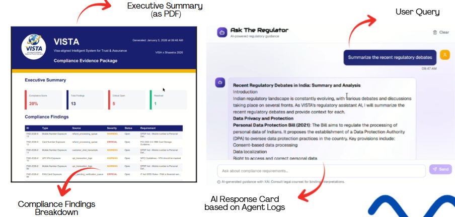
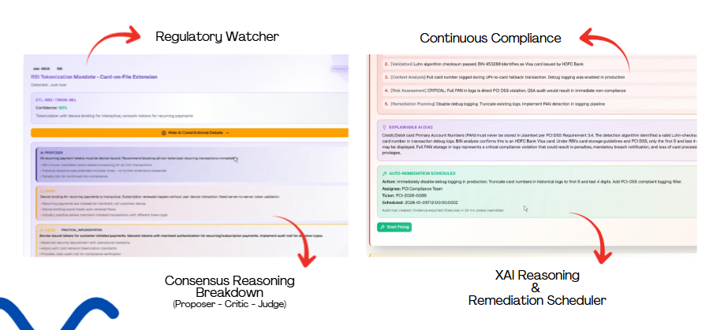

<div align="center">

<table border="0" cellspacing="0" cellpadding="0" style="border: none;">
<tr>
<td align="left" width="120" style="padding-right: 20px; border: none;">

</td>
<td align="left" style="border: none; background: #1A1F71; padding: 20px 40px; border-radius: 8px;">
<h1 style="color: white; margin: 0; font-size: 36px; font-weight: bold;">VISTA</h1>
<h3 style="color: #F7B600; margin: 5px 0 0 0; font-size: 18px; font-weight: normal;">Visa-aligned Intelligent System for Trust & Assurance</h3>
</td>
</tr>
</table>


**Autonomous Agentic AI for Continuous PCI/PII Compliance**


[](https://spring.io/projects/spring-boot)
[](https://nextjs.org/)
[](https://fastapi.tiangolo.com/)
[](https://www.python.org/)
[](https://www.typescriptlang.org/)
[](https://langchain.com/)
[](https://github.com/facebookresearch/faiss)
[](https://deepmind.google/technologies/gemini/)


**VISA × Shaastra 2026 | PS4 - Agentic AI for Compliance Automation | Team JNR**

</div>

---

## The Problem

**Indian FinTechs face a compliance perfect storm:**

| Regulatory Body | Challenge | Update Frequency |
|----------------|-----------|------------------|
| **RBI** | Data localization, tokenization mandates | Weekly circulars |
| **DPDP Act** | Consent requirements, data protection officers | New legislation |
| **PCI DSS** | 64 new requirements, continuous monitoring | Annual updates |
| **CERT-In** | 6-hour incident reporting, 180-day log retention | Urgent mandates |
| **NPCI** | UPI security, transaction monitoring | Regular updates |

**Traditional compliance teams are drowning:**
-  Manual regulation tracking across 10+ regulatory bodies
-  Excel spreadsheets to scan for PAN/Aadhaar exposure
-  48-72 hours to detect a single PCI violation
-  2-3 weeks to prepare audit evidence packages
-  40-60% false positive rates in detection tools


---

## The Solution: VISTA

**VISTA** is an autonomous, agentic AI-powered compliance platform designed for Visa's network-scale regulatory challenges. Unlike traditional compliance tools that require manual triggers, VISTA operates through a continuous compliance loop where AI agents autonomously detect regulatory changes, interpret obligations, scan data, remediate violations, and generate audit-ready evidence 24/7, without human intervention.

### Core Innovation

> **Behavioral Autonomy over Orchestration**  
> Agents aren't scripts or models, they're autonomous, event-driven services that interpret regulations, enforce deterministic compliance, and generate audit-ready evidence continuously.

## Architecture

### The Continuous Compliance Loop

```
┌──────────────────────────────────────────────────────────────────┐
│                                                                  │
│    REGULATION  →  INTERPRET  →  SCAN  →  FIX  →  LEARN         │
│         ↑                                            ↓           │
│         └────────────────────────────────────────────┘           │
│                      CONTINUOUS LOOP                             │
│                                                                  │
└──────────────────────────────────────────────────────────────────┘
```

### System Design

<div align="center">

</div>


### Agent Flow

<div align="center">

</div>

---

## AI Agents 

### Autonomous Agent Architecture

<table>
<tr>
<th width="25%"> Watcher Agent</th>
<th width="25%"> Interpreter Agent</th>
<th width="25%"> Monitor Agent</th>
<th width="25%"> Remediator Agent</th>
</tr>
<tr>
<td valign="top">

**Monitors regulatory feeds** (PCI SSC, RBI, NPCI, DPDP Act)

**Trigger:** Every 6 hours

**Tech:** Deterministic RSS/web scraping

**Output:** `regulation.updated` event

</td>
<td valign="top">

**Interprets regulations** via Constitutional AI debate (Proposer → Critic → Judge)

**Trigger:** On regulation change

**Tech:** Google Gemini 2.5 Flash

**Output:** `controls.updated` event

**Impact:** 80% ↓ hallucination

</td>
<td valign="top">

**Detects PCI/PII violations** via 6-stage pipeline (Pattern → Validation → Context → Confidence → Mapping → Masking)

**Trigger:** On new data

**Tech:** Regex + Luhn/Verhoeff + Gemini context

**Output:** `violation.detected` event

**Precision:** 99.5%

</td>
<td valign="top">

**Auto-remediates violations** (Mask → Policy Update → XAI Trace → Evidence PDF)

**Trigger:** On violation

**Tech:** Gemini (XAI only)

**Masking:** Card `****-0366`, Aadhaar `****-7842`, PAN `AB***4F`

**Output:** `evidence.generated` event

</td>
</tr>
</table>

---

### RAG-Powered Compliance Assistant

<table>
<tr>
<td width="50%" valign="top">

**Architecture Components**

| Layer | Technology |
|-------|-----------|
| **LLM** | Google Gemini 2.5 Flash |
| **Embeddings** | Sentence Transformers (384-dim) |
| **Vector Store** | FAISS (cosine similarity) |
| **Orchestration** | LangChain |
| **Processing** | PyPDF, Unstructured |
| **Scraping** | Selenium, Playwright |

</td>
<td width="50%" valign="top">

**Configuration & Sources**

- **Chunk Size:** 512 tokens (50 overlap)
- **Retrieval:** MMR (diversity + relevance)
- **Reranking:** Cross-encoder boosting

**Indexed Data:**
- PCI DSS v4.0 (250+ controls)
- DPDP Act 2023, RBI Circulars
- UIDAI, CERT-In, NPCI Guidelines

**Purpose:** Answers compliance queries with cited regulatory sources (no hallucination)

</td>
</tr>
</table>


---

## Quick Start

### Prerequisites

- **Node.js** and npm/pnpm
- **Python**
- **Java** (for Spring Boot backend)
- **Git**

### 1. Clone Repository

```bash
git clone https://github.com/fromjyce/VISTA.git
cd VISTA
```

### 2. Frontend Setup

```bash
cd Frontend
npm install  # or pnpm install

# Run development server
npm run dev

# Build for production
npm run build && npm start
```

Frontend: **http://localhost:3000**

### 3. Python Backend Setup

```bash
cd py_backend

# Create virtual environment
python -m venv venv

# Activate (Windows)
.\venv\Scripts\Activate.ps1
# Activate (Linux/Mac)
source venv/bin/activate

# Install dependencies
pip install -r requirements.txt

# Create .env file
echo "GEMINI_API_KEY=your_api_key_here" > .env
echo "HOST=localhost" >> .env
echo "PORT=8000" >> .env

# Run server
uvicorn main:app --reload
```

Backend API: **http://localhost:8000**  
API Docs: **http://localhost:8000/docs**

### 4. RAG Model Setup

```bash
cd RAG_MODEL
pip install -r requirements.txt

# Index regulatory documents
python main.py index

# Start RAG API server
python main.py api --port 8080
```

RAG API: **http://localhost:8080**

### 5. Java Backend

```bash
cd vista-backend

# Build with Maven
mvn clean install

# Run gateway service
cd gateway
mvn spring-boot:run
```

---

## Technology Stack

### Frontend Layer

| Technology | Purpose |
|------------|---------|
| **Next.js** | React framework with App Router |
| **React** | UI library |
| **TypeScript** | Type safety |
| **Tailwind CSS** | Utility-first styling |
| **shadcn/ui** | Component library (Radix UI primitives) |
| **Recharts** | Data visualization |
| **Lucide React** | Icon library |
| **jsPDF** | PDF evidence generation |
| **Zustand** | Lightweight state management |

### Python Backend

| Technology | Purpose |
|------------|---------|
| **FastAPI** | High-performance async API framework |
| **Python** | Runtime |
| **Uvicorn** | ASGI server |
| **Pydantic** | Data validation and serialization |
| **aiosqlite** | Async SQLite database |
| **Google Gemini** | LLM integration (Constitutional AI) |
| **httpx** | Async HTTP client |
| **WebSockets** | Real-time communication |

### AI/ML & RAG

| Technology | Purpose |
|-----------|---------|
| **Google Gemini** | Constitutional AI debates, XAI explanations |
| **LangChain** | RAG orchestration and chain management |
| **FAISS** | Vector similarity search (Facebook AI) |
| **Sentence Transformers** | Document embeddings |
| **ChromaDB** | Alternative vector store |
| **PyPDF** | PDF document parsing |
| **Unstructured** | Structured data extraction |
| **BeautifulSoup** | HTML parsing for web scraping |
| **Selenium/Playwright** | Dynamic web scraping |

### Java Backend 

| Technology | Purpose |
|------------|---------|
| **Spring Boot** | Enterprise backend framework |
| **Java** | Runtime |
| **Apache Kafka** | Event-driven messaging |
| **Spring Cloud** | Microservices support |
| **Maven** | Build tool |
| **PostgreSQL** | Relational database |

### DevOps & Infrastructure

- **Docker** - Containerization
- **Docker Compose** - Multi-container orchestration
- **Git** - Version control
- **Ansible** (for policy deployment)

---

##  Project Structure

```
VISTA/
├── Frontend/                    # Next.js Frontend
│   ├── app/                    # App Router pages
│   │   ├── page.tsx           # Landing page
│   │   ├── dashboard/         # Compliance dashboard
│   │   ├── watcher/           # Regulatory watcher
│   │   ├── compliance/        # Continuous compliance loop
│   │   ├── ask/               # RAG-powered chatbot
│   │   └── export/            # Evidence export
│   ├── components/            # React components
│   │   ├── sidebar.tsx        # Navigation
│   │   └── ui/                # shadcn/ui components
│   ├── lib/
│   │   ├── store.ts           # Zustand state
│   │   └── utils.ts           # Helper functions
│   └── public/
│       └── logo.png           # VISTA logo
│
├── py_backend/                 # Python FastAPI Backend
│   ├── agents/                # AI Agents
│   │   ├── watcher.py
│   │   ├── interpreter.py
│   │   ├── monitor.py
│   │   └── remediator.py
│   ├── detection/             # Detection Engine
│   │   ├── patterns.py        # Regex patterns
│   │   ├── validators.py      # Luhn/Verhoeff
│   │   ├── context.py         # LLM context analysis
│   │   └── confidence.py      # Multi-factor scoring
│   ├── xai/                   # Explainability
│   │   ├── tracer.py          # Reasoning chains
│   │   └── evidence.py        # Evidence generation
│   ├── api/                   # REST API
│   │   ├── routes.py
│   │   └── websocket.py
│   ├── database/              # Database layer
│   │   ├── models.py
│   │   └── repository.py
│   └── events/                # Event bus
│       └── bus.py
│
├── RAG_MODEL/                  # RAG System
│   ├── scraper/               # Regulatory scrapers
│   │   ├── rbi_scraper.py
│   │   ├── pci_scraper.py
│   │   └── dpdp_scraper.py
│   ├── vectorstore/           # FAISS integration
│   ├── retrieval/             # Retrieval + reranking
│   ├── chain/                 # LangChain Q&A chains
│   ├── llm/                   # Gemini integration
│   └── data/
│       ├── regulations/       # Scraped documents
│       └── vectorstore/       # FAISS index
│
├── vista-backend/              # Java Spring Boot (Optional)
│   ├── gateway/               # API Gateway
│   ├── compliance-core/       # Core services
│   │   ├── control-library/   # Compliance controls
│   │   ├── compliance-state/  # State management
│   │   └── audit-ledger/      # Audit logging
│   └── pom.xml
│
├── docker/                     # Docker configuration
├── deliverables/               # Hackathon deliverables
├── README.md                   # This file
└── LICENSE
```

---

##  Demo Snapshots





---


