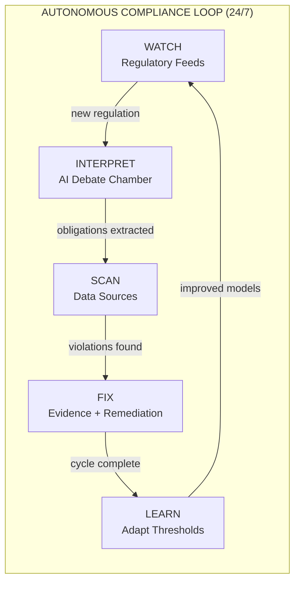
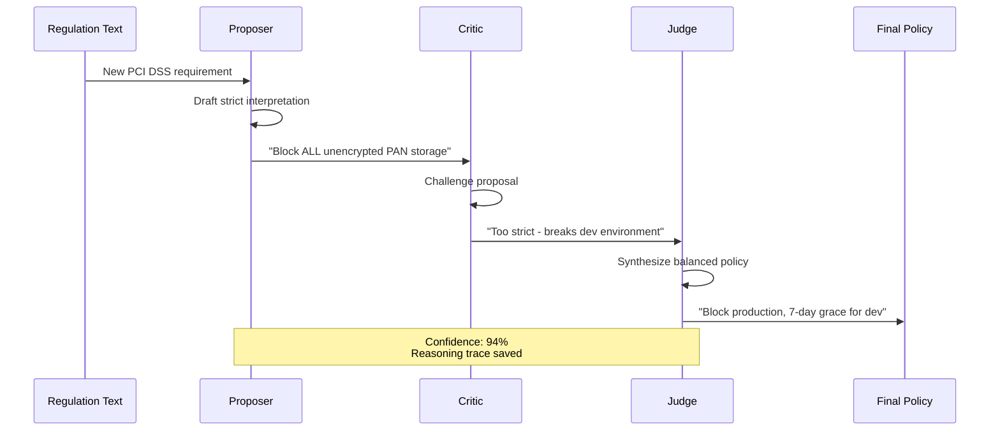
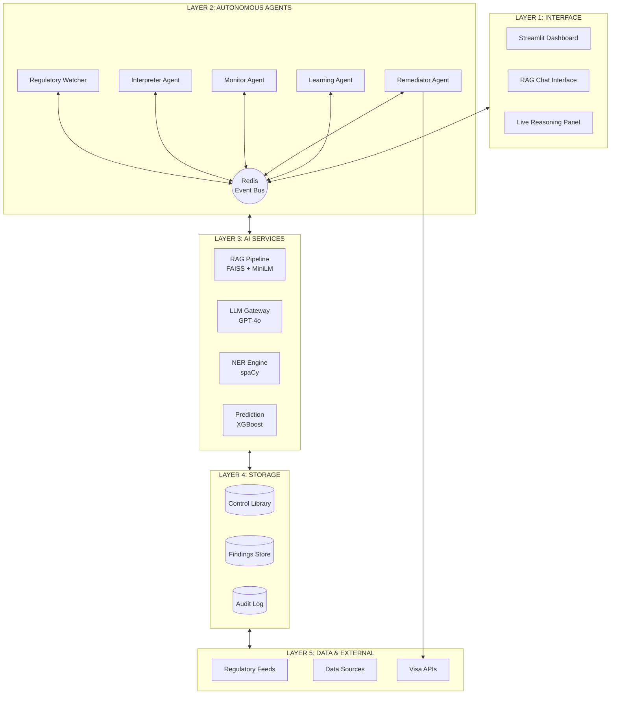
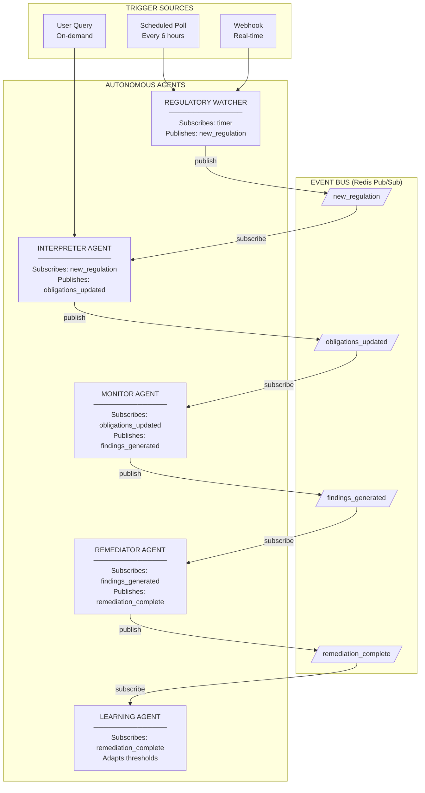
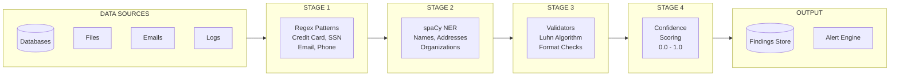
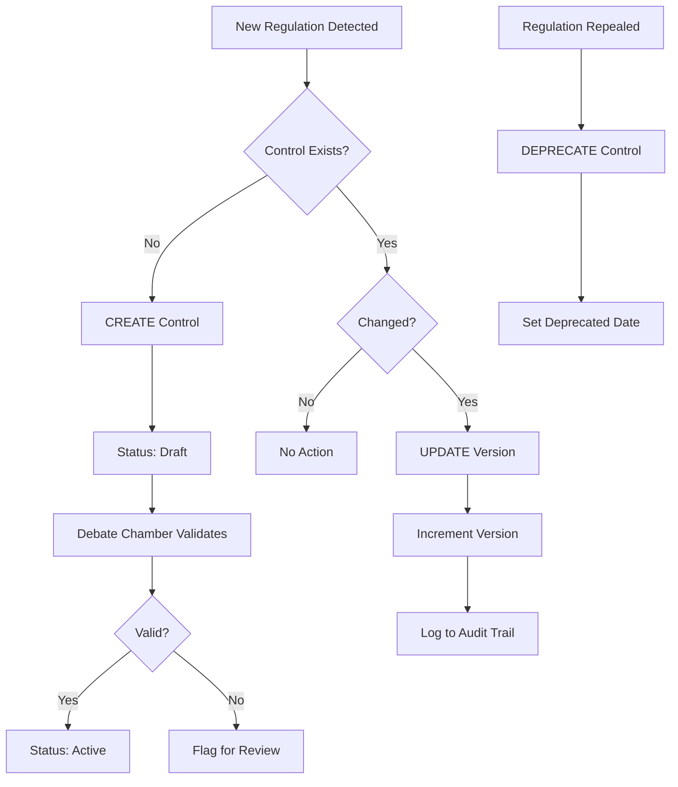
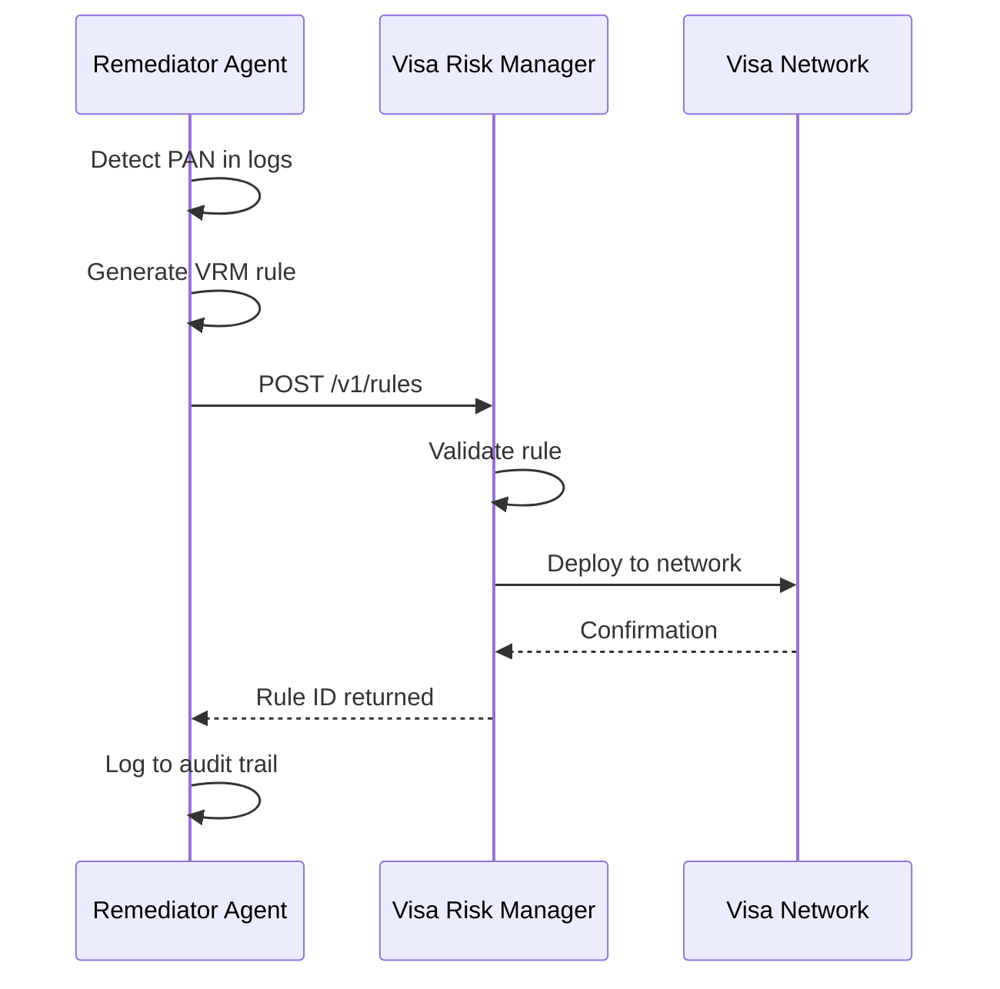
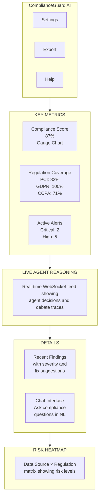

# ComplianceGuard AI

## Agentic AI-Enabled Continuous PCI/PII Compliance Platform

**Problem Statement 4** | VISA x Shaastra 2026 - 24 Hour AI Hackathon

---

## 1. Problem Statement

### The Compliance Crisis in Financial Services

Financial institutions operate under strict regulatory frameworks—PCI DSS for payment card security, GDPR for European data privacy, CCPA for California residents, and AML regulations for anti-money laundering. Non-compliance leads to massive fines, reputational damage, and security breaches.

**The core problem:** Traditional compliance is manual, reactive, and point-in-time. Teams read 400-page regulatory documents manually, conduct annual audits instead of continuous monitoring, and detect violations only after breaches occur.

### Industry Pain Points (Verified Statistics)

| Pain Point | Impact | Source |
|------------|--------|--------|
| Average data breach cost in financial sector | **$6.08 million** | IBM Cost of Data Breach Report 2024 |
| Mean time to identify a breach | **197 days** | IBM Cost of Data Breach Report 2024 |
| Increase in compliance hours since 2020 | **+61%** | Bank Policy Institute Survey 2024 |
| Total GDPR fines issued since 2018 | **$5.88 billion** | DLA Piper GDPR Fines Tracker 2025 |
| New requirements in PCI DSS 4.0 | **64 new controls** | PCI Security Standards Council |

### What PS4 Demands

PS4 requires an **"agentic AI-powered compliance platform built on autonomous, agent-based systems that can make decisions, plan tasks, and operate independently using tools and data, without constant human supervision."**

Key requirements include:
- Autonomous regulatory interpretation across GDPR, CCPA, LGPD, PCI DSS
- Agent-based monitoring of transactions, communications, and logs in real-time
- Natural language interaction with regulations and findings
- Dynamic risk dashboards and audit-ready evidence packages
- Agents that adapt behavior based on real-time feedback

---

## 2. Solution Overview

### Our Approach: Autonomous Compliance Loop

ComplianceGuard AI is a multi-agent system where specialized AI agents work together in a **continuous, self-triggering loop**. Unlike traditional orchestrated systems where a central controller routes tasks, our agents trigger each other automatically through an event-driven architecture.

When a new regulation is published, the system automatically:
1. **Detects** the change via RSS feed monitoring
2. **Interprets** it using a 3-agent debate chamber
3. **Scans** all company data for violations
4. **Generates** fixes and audit-ready evidence
5. **Learns** from feedback to improve accuracy

All of this happens **without any human clicking buttons**.

### The Autonomous Loop

### Key Innovation: Constitutional AI Debate Chamber

Large Language Models can "hallucinate"—generating plausible-sounding but incorrect interpretations of regulations. In compliance, a hallucinated loophole could lead to millions in fines.

Our solution: **Three AI agents debate each interpretation before finalizing it.**

- **Proposer Agent:** Drafts a conservative, strict interpretation
- **Critic Agent:** Challenges the proposal, finds loopholes and over-restrictions
- **Judge Agent:** Synthesizes a balanced, practical policy from both perspectives

This adversarial self-review reduces hallucination and creates a defensible reasoning trace for auditors.

---

## 3. System Architecture

### Five-Layer Architecture

Our system is organized into five distinct layers, each with specific responsibilities:

**Layer 1 - Interface:** User-facing components including the compliance dashboard, natural language chat interface, and live reasoning panel that shows AI decision-making in real-time.

**Layer 2 - Agents:** Five autonomous agents that communicate via Redis Pub/Sub events. Each agent subscribes to specific event types and publishes results that trigger downstream agents.

**Layer 3 - AI Services:** Core AI capabilities including the RAG pipeline for regulatory Q&A, LLM gateway for reasoning, and NER models for entity detection.

**Layer 4 - Storage:** Persistent storage for the control library (with version control), findings store, and immutable audit logs.

**Layer 5 - Data & External:** Integration with regulatory feeds, enterprise data sources, and Visa APIs for rule deployment.

---

## 4. Agent Architecture

### Self-Triggering Event Flow

The key differentiator of our architecture is that **agents trigger each other automatically** via events. There is no central scheduler or human-initiated workflow.

Each agent:
- **Subscribes** to specific event channels
- **Processes** incoming events autonomously
- **Publishes** results to trigger downstream agents

### Agent Responsibilities

**Regulatory Watcher:** Monitors RSS feeds from PCI SSC, EUR-Lex, FinCEN, and other regulatory bodies. Uses SHA-256 hash comparison to detect document changes. Polls every 6 hours and emits `new_regulation` events.

**Interpreter Agent:** Receives regulatory documents and runs the Constitutional AI Debate. Extracts obligations, definitions, and required controls. Updates the Control Library with new or modified controls.

**Monitor Agent:** Scans enterprise data sources (databases, files, emails, logs) for PII/PCI violations. Uses a three-stage pipeline: Regex pattern matching → spaCy NER → Validation (Luhn algorithm for credit cards). Calculates risk scores and emits findings.

**Remediator Agent:** Generates fix recommendations using RAG to find relevant guidance. Creates structured evidence packages for auditors. Pushes compliance rules to Visa Risk Manager API.

**Learning Agent:** Collects feedback on false positives and remediation outcomes. Adjusts detection thresholds and retrains prediction models. Enables the system to improve accuracy over time.

---

## 5. Module Details

### Detection Pipeline

The Monitor Agent uses a multi-stage pipeline to detect sensitive data with high accuracy:

**Stage 1 - Pattern Matching:** Regex patterns identify potential PII/PCI data (credit cards, SSNs, emails, phone numbers).

**Stage 2 - Entity Recognition:** spaCy NER model extracts named entities (person names, addresses, organizations) that regex cannot capture.

**Stage 3 - Validation:** Validators confirm data validity—Luhn algorithm for credit cards, format checks for SSNs, RFC 5322 for emails.

**Stage 4 - Confidence Scoring:** Final score calculated as: Base (0.70) + Validation pass (+0.25) - No context (-0.35). Only findings above threshold are reported.

### Control Library Management

PS4 explicitly requires agents to **"update control libraries"**. Our Control Library Manager handles the complete lifecycle:

Each control is versioned with full audit trail, showing which agent made changes and why.

### Adaptive Learning

The Learning Agent enables the system to improve over time by processing feedback:

- **False Positive Feedback:** When users mark a finding as incorrect, the system adjusts detection thresholds
- **Remediation Outcomes:** Successful fixes are prioritized in future recommendations
- **Interpretation Corrections:** Human corrections improve the Constitutional AI prompts

This creates a continuous improvement loop where the system becomes more accurate with use.

---

## 6. Visa API Integration

As a Visa hackathon, integration with Visa APIs demonstrates real-world applicability:

**Visa Risk Manager (VRM):** When the Remediator Agent detects a payment-related violation, it automatically generates a VRM rule and pushes it to the Visa network via API. This enables real-time fraud prevention.

**Visa Transaction Controls (VCTC):** For data quality issues (e.g., unclear merchant names), the system can trigger user verification via VCTC, cleaning data at the source.

---

## 7. PS4 Requirements Mapping

| PS4 Requirement | Our Implementation |
|-----------------|-------------------|
| **"Autonomous agents"** | 5 agents communicate via Redis Pub/Sub, triggering each other without human intervention |
| **"Make decisions, plan tasks"** | Constitutional AI Debate Chamber makes interpretation decisions with reasoning traces |
| **"Operate independently"** | Event-driven architecture—agents run 24/7 without manual triggers |
| **"Without constant human supervision"** | Full autonomous loop; humans only review high-risk decisions |
| **"Adapt behavior based on feedback"** | Learning Agent adjusts thresholds and retrains models from user feedback |
| **"Monitor transactions, communications, logs"** | Unified scanner covers databases, files, O365 emails, Slack, application logs |
| **"Predictive behavioral insights"** | XGBoost model predicts 7-day risk scores; Prophet for trend forecasting |
| **"Natural language interaction"** | RAG-powered chat interface answers compliance questions with citations |
| **"AI-generated dashboards"** | LLM generates Plotly visualization code at runtime based on user queries |
| **"Update control libraries"** | Auto CREATE/UPDATE/DEPRECATE with version control and audit trail |
| **"Evidence packages"** | Structured packages with findings, reasoning traces, and remediation steps |

---

## 8. Technology Stack

| Component | Technology | Rationale |
|-----------|------------|-----------|
| **Agent Orchestration** | LangGraph | Supports cyclic workflows (debate loops, retry logic) |
| **Event Bus** | Redis Pub/Sub | Low-latency agent-to-agent messaging |
| **Primary LLM** | GPT-4o-mini | Cost-effective ($0.15/1M tokens), handles 90% of calls |
| **Complex LLM** | GPT-4o | Reserved for Judge decisions and ambiguous cases |
| **Embeddings** | MiniLM-L6-v2 | Free, local, 384-dimensional vectors |
| **Vector Store** | FAISS | In-memory, sub-millisecond similarity search |
| **NER** | spaCy (en_core_web_sm) | Production-ready named entity recognition |
| **Prediction** | XGBoost + Prophet | Risk classification + time series forecasting |
| **Dashboard** | Streamlit + Plotly | Rapid prototyping with interactive visualizations |
| **Database** | SQLite | Zero-configuration, sufficient for hackathon scale |
| **External APIs** | Visa Developer Platform | VRM for rule deployment, VCTC for user verification |

---

## 9. Dashboard Wireframe

The user interface provides real-time visibility into compliance status:

**Key Components:**
- **Compliance Score:** Overall percentage with gauge visualization
- **Live Reasoning:** WebSocket-powered real-time agent activity log
- **Findings Table:** Sortable violations with severity and fix recommendations
- **Chat Interface:** Natural language Q&A about compliance status
- **Risk Heatmap:** Matrix showing which data sources have issues per regulation

---

## 10. References

### Regulatory Sources
- PCI Security Standards Council: https://www.pcisecuritystandards.org
- EUR-Lex (GDPR): https://eur-lex.europa.eu/eli/reg/2016/679/oj
- California AG (CCPA): https://oag.ca.gov/privacy/ccpa
- FinCEN (AML): https://www.fincen.gov
- Visa Developer Portal: https://developer.visa.com

### Industry Statistics
- IBM Cost of Data Breach Report 2024: $6.08M average breach cost, 197 days MTTI
- DLA Piper GDPR Fines Tracker 2025: $5.88B total fines
- Bank Policy Institute Survey 2024: 61% increase in compliance hours
- PCI SSC: 64 new requirements in PCI DSS 4.0 (effective March 2025)

### Technical References
- Constitutional AI Paper: arxiv.org/abs/2212.08073 (Anthropic, 2022)
- LangGraph Documentation: langchain-ai.github.io/langgraph
- FAISS: github.com/facebookresearch/faiss

---

## Why This Solution Wins

| Criteria | Our Strength |
|----------|--------------|
| **True Autonomy** | Agents self-trigger via events—no human buttons needed |
| **Innovation** | Constitutional AI Debate is a novel approach to hallucination reduction |
| **PS4 Alignment** | Every requirement explicitly addressed with specific implementation |
| **Visa Integration** | Direct API integration with Risk Manager for rule deployment |
| **Practicality** | Standard open-source stack, buildable in 24-hour hackathon |
| **Transparency** | Live reasoning traces let judges see AI decision-making |

---

*ComplianceGuard AI — Autonomous Compliance, Continuous Protection*
